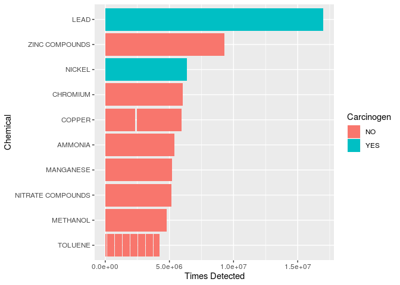

###Objective 0

Tidy data.


```r
library(tidyverse)
```

```
## ── Attaching packages ──────────────────────────────────────────────────────────────────────── tidyverse 1.2.1 ──
```

```
## ✔ ggplot2 3.2.1     ✔ purrr   0.3.2
## ✔ tibble  2.1.3     ✔ dplyr   0.8.3
## ✔ tidyr   1.0.0     ✔ stringr 1.4.0
## ✔ readr   1.3.1     ✔ forcats 0.4.0
```

```
## ── Conflicts ─────────────────────────────────────────────────────────────────────────── tidyverse_conflicts() ──
## ✖ dplyr::filter() masks stats::filter()
## ✖ dplyr::lag()    masks stats::lag()
```

```r
library(readr)
library(janitor)
```

```
## 
## Attaching package: 'janitor'
```

```
## The following objects are masked from 'package:stats':
## 
##     chisq.test, fisher.test
```

```r
library(ggmap)
```

```
## Google's Terms of Service: https://cloud.google.com/maps-platform/terms/.
```

```
## Please cite ggmap if you use it! See citation("ggmap") for details.
```

```r
library(maps)
```

```
## 
## Attaching package: 'maps'
```

```
## The following object is masked from 'package:purrr':
## 
##     map
```

```r
library(usethis)

tri2018 <- read_csv("data/tri_2018_us.csv")
```

```
## Warning: Missing column names filled in: 'X114' [114]
```

```
## Parsed with column specification:
## cols(
##   .default = col_double(),
##   `2. TRIFD` = col_character(),
##   `4. FACILITY NAME` = col_character(),
##   `5. STREET ADDRESS` = col_character(),
##   `6. CITY` = col_character(),
##   `7. COUNTY` = col_character(),
##   `8. ST` = col_character(),
##   `9. ZIP` = col_character(),
##   `11. TRIBE` = col_character(),
##   `14. FEDERAL FACILITY` = col_character(),
##   `16. INDUSTRY SECTOR` = col_character(),
##   `17. PRIMARY SIC` = col_logical(),
##   `18. SIC 2` = col_logical(),
##   `19. SIC 3` = col_logical(),
##   `20. SIC 4` = col_logical(),
##   `21. SIC 5` = col_logical(),
##   `22. SIC 6` = col_logical(),
##   `28. NAICS 6` = col_logical(),
##   `30. CHEMICAL` = col_character(),
##   `31. CAS #/COMPOUND ID` = col_character(),
##   `33. CLEAN AIR ACT CHEMICAL` = col_character()
##   # ... with 9 more columns
## )
```

```
## See spec(...) for full column specifications.
```

```
## Warning: 82667 parsing failures.
## row col    expected      actual                   file
##   1  -- 114 columns 113 columns 'data/tri_2018_us.csv'
##   2  -- 114 columns 113 columns 'data/tri_2018_us.csv'
##   3  -- 114 columns 113 columns 'data/tri_2018_us.csv'
##   4  -- 114 columns 113 columns 'data/tri_2018_us.csv'
##   5  -- 114 columns 113 columns 'data/tri_2018_us.csv'
## ... ... ........... ........... ......................
## See problems(...) for more details.
```

```r
tri2018 <- clean_names(tri2018)

usa <- map_data("usa")
```
###Objective 1

Determine the most common toxic pollutant in the US.


```r
topten <- tri2018 %>%

  count(x30_chemical) %>%
  arrange(desc(n)) %>%
  slice(1:10) %>%
  right_join(., tri2018) %>%
  filter(n != "NA")
```

```
## Joining, by = "x30_chemical"
```

```r
topten %>%
  ggplot(aes(x = reorder(x30_chemical, n), y = n, fill = x37_carcinogen)) +
  geom_bar(stat = "identity") +
  coord_flip() +
  labs(y = "Times Detected", x = "Chemical", fill = "Carcinogen")
```

<!-- -->

###Objective 2

Develop a map showing the measurement locations of the top ten pollutants in the US.


```r
topten %>%
  filter(x30_chemical == "LEAD" | x30_chemical == "NICKEL") %>%
  ggplot(aes(x13_longitude, x12_latitude, size = x54_on_site_release_total, color = x30_chemical
             )) +
  geom_point() +
  xlim(-125,-50) +
  labs(x = "", y = "", size = "Total Chemical Released", color = "Chemical") +
  theme_bw()
```

```
## Warning: Removed 58 rows containing missing values (geom_point).
```

<!-- -->

Questions: why is there a line running down the middle of the country? What is making the states past Texas so much less likely to have carcinogenic compound releases in the way that the East and Midwest see?

###Objective 3


