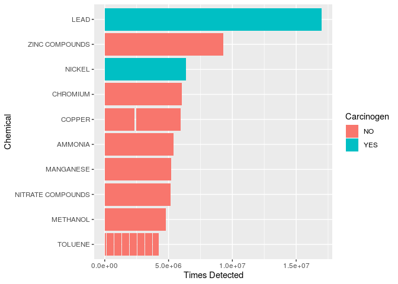
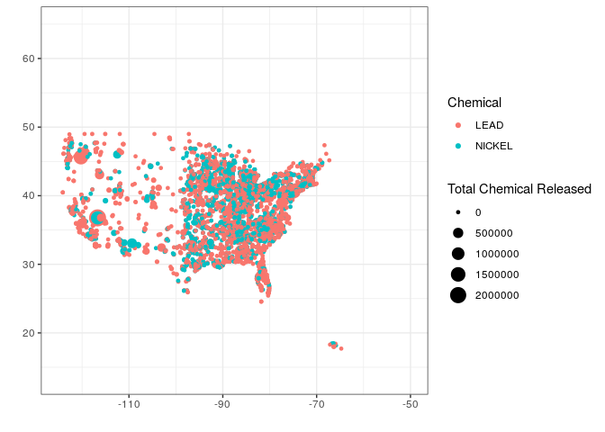

National Toxic Pollutants
================
Beck Addison
10.08.19

\#\#\#Objective 0

Tidy
    data.

``` r
library(tidyverse)
```

    ## ── Attaching packages ──────────────────────────────────────────────────────────────────────── tidyverse 1.2.1 ──

    ## ✔ ggplot2 3.2.1     ✔ purrr   0.3.2
    ## ✔ tibble  2.1.3     ✔ dplyr   0.8.3
    ## ✔ tidyr   1.0.0     ✔ stringr 1.4.0
    ## ✔ readr   1.3.1     ✔ forcats 0.4.0

    ## ── Conflicts ─────────────────────────────────────────────────────────────────────────── tidyverse_conflicts() ──
    ## ✖ dplyr::filter() masks stats::filter()
    ## ✖ dplyr::lag()    masks stats::lag()

``` r
library(readr)
library(janitor)
```

    ## 
    ## Attaching package: 'janitor'

    ## The following objects are masked from 'package:stats':
    ## 
    ##     chisq.test, fisher.test

``` r
library(ggmap)
```

    ## Google's Terms of Service: https://cloud.google.com/maps-platform/terms/.

    ## Please cite ggmap if you use it! See citation("ggmap") for details.

``` r
library(maps)
```

    ## 
    ## Attaching package: 'maps'

    ## The following object is masked from 'package:purrr':
    ## 
    ##     map

``` r
tri2018 <- read_csv("data/tri_2018_us.csv")
```

    ## Warning: Missing column names filled in: 'X114' [114]

    ## Parsed with column specification:
    ## cols(
    ##   .default = col_double(),
    ##   `2. TRIFD` = col_character(),
    ##   `4. FACILITY NAME` = col_character(),
    ##   `5. STREET ADDRESS` = col_character(),
    ##   `6. CITY` = col_character(),
    ##   `7. COUNTY` = col_character(),
    ##   `8. ST` = col_character(),
    ##   `9. ZIP` = col_character(),
    ##   `11. TRIBE` = col_character(),
    ##   `14. FEDERAL FACILITY` = col_character(),
    ##   `16. INDUSTRY SECTOR` = col_character(),
    ##   `17. PRIMARY SIC` = col_logical(),
    ##   `18. SIC 2` = col_logical(),
    ##   `19. SIC 3` = col_logical(),
    ##   `20. SIC 4` = col_logical(),
    ##   `21. SIC 5` = col_logical(),
    ##   `22. SIC 6` = col_logical(),
    ##   `28. NAICS 6` = col_logical(),
    ##   `30. CHEMICAL` = col_character(),
    ##   `31. CAS #/COMPOUND ID` = col_character(),
    ##   `33. CLEAN AIR ACT CHEMICAL` = col_character()
    ##   # ... with 9 more columns
    ## )

    ## See spec(...) for full column specifications.

    ## Warning: 82667 parsing failures.
    ## row col    expected      actual                   file
    ##   1  -- 114 columns 113 columns 'data/tri_2018_us.csv'
    ##   2  -- 114 columns 113 columns 'data/tri_2018_us.csv'
    ##   3  -- 114 columns 113 columns 'data/tri_2018_us.csv'
    ##   4  -- 114 columns 113 columns 'data/tri_2018_us.csv'
    ##   5  -- 114 columns 113 columns 'data/tri_2018_us.csv'
    ## ... ... ........... ........... ......................
    ## See problems(...) for more details.

``` r
tri2018 <- clean_names(tri2018)

usa <- map_data("usa")
```

\#\#\#Objective 1

Determine the most common toxic pollutant in the US.

``` r
topten <- tri2018 %>%

  count(x30_chemical) %>%
  arrange(desc(n)) %>%
  slice(1:10) %>%
  right_join(., tri2018) %>%
  filter(n != "NA")
```

    ## Joining, by = "x30_chemical"

``` r
topten %>%
  ggplot(aes(x = reorder(x30_chemical, n), y = n, fill = x37_carcinogen)) +
  geom_bar(stat = "identity") +
  coord_flip() +
  labs(y = "Times Detected", x = "Chemical", fill = "Carcinogen")
```

<!-- -->

\#\#\#Objective 2

Develop a map showing the measurement locations of the top ten
pollutants in the US.

``` r
topten %>%
  ggplot(aes(x13_longitude, x12_latitude, size = x54_on_site_release_total, color = x30_chemical)) +
  geom_point() +
  xlim(-175,-50) +
  labs(x = "", y = "", size = "Total Chemical Released", color = "Chemical") +
  theme_bw()
```

    ## Warning: Removed 154 rows containing missing values (geom_point).

<!-- -->

\#\#\#Objective 3
